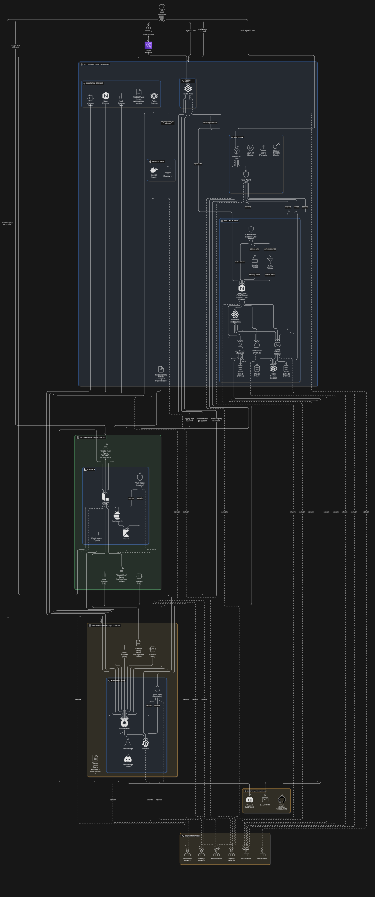

# ft_transcendence

A production-grade microservices platform featuring real-time multiplayer Pong, user management, and live chat. Built with Docker Swarm orchestration and comprehensive DevOps infrastructure including centralized logging (ELK), monitoring (Prometheus/Grafana), and secrets management (HashiCorp Vault).

## Overview

This project implements a full-stack web application with a focus on scalability, security, and observability. The architecture follows microservices patterns with service mesh capabilities, automated deployments, and enterprise-level operational tooling.

## Architecture

The platform is organized into three main layers.



### Application Services

- Real-time multiplayer Pong game with WebSocket support
- Turn-based XO game with AI and PvP matchmaking
- User authentication and profile management (OAuth2 with GitHub, 42 Intra, and Google)
- Live chat system with room management
- Responsive frontend with real-time updates

### Infrastructure Services

- Traefik reverse proxy with automatic HTTPS
- HashiCorp Vault for secrets management
- Redis for session storage and caching
- SQLite databases per service

### Observability Stack

- ELK Stack (Elasticsearch, Logstash, Kibana) for centralized logging
- Prometheus + Grafana for metrics and monitoring
- Custom exporters for service-specific metrics
- Distributed tracing with request correlation

## Core Features

- Real-time Pong gameplay using WebSocket connections
- Match queue system with automated pairing
- Game state synchronization across clients
- Player statistics and match history
- Built with Fastify and TypeScript

### XO Game Service

- Turn-based tic-tac-toe with AI and PvP modes
- Fastify server with WebSocket channels for live moves
- SQLite + Sequelize persistence for match history
- Cookie support for lightweight session tracking

### User Service

- Multi-provider OAuth2 authentication (GitHub, 42 Intra, Google)
- JWT-based session management
- Two-factor authentication support
- Profile management with avatar uploads
- Friend system and user search
- Rate limiting and request throttling

### Chat Service

- Real-time messaging with WebSocket
- Public and private chat rooms
- Direct messaging between users
- Message history with pagination
- Online presence indicators
- Built on Node.js with Prisma ORM

### Frontend

- Modern single-page application
- Real-time UI updates without page reloads
- Responsive design with Tailwind CSS
- TypeScript for type safety
- Vite for fast development builds

## DevOps Infrastructure

### Logging Stack (ELK)

Complete centralized logging solution with structured log collection and analysis:

- **Elasticsearch**: Distributed storage and search for logs
- **Logstash**: Log parsing, enrichment, and transformation pipelines
- **Kibana**: Web interface for log visualization and dashboards
- **Filebeat**: Lightweight log shippers on each node
- Service-specific log formats with JSON parsing
- Automated index lifecycle management
- Real-time log streaming and search

### Monitoring Stack

Production-ready metrics collection and alerting:

- **Prometheus**: Time-series metrics database with service discovery
- **Grafana**: Dashboard creation with pre-configured visualizations
- **Alertmanager**: Alert routing and notification management
- **Node Exporter**: System-level metrics (CPU, memory, disk, network)
- **cAdvisor**: Container resource usage metrics
- **Custom Exporters**: Redis, Elasticsearch, and service-specific metrics
- Discord webhook integration for alerts

### Secrets Management

Enterprise secrets management with HashiCorp Vault:

- AppRole authentication for service-to-service communication
- Dynamic secret generation for databases
- Automated secret rotation
- TLS certificate management
- Policy-based access control
- Audit logging for all secret access

### Service Mesh

Traefik-based routing and load balancing:

- Automatic service discovery in Docker Swarm
- Dynamic configuration via labels
- Built-in HTTPS with Let's Encrypt support
- Request routing and path-based routing
- Health checks and circuit breakers
- Middleware chains for authentication and rate limiting

### Container Orchestration

Docker Swarm cluster management:

- Multi-node deployment support
- Rolling updates with zero downtime
- Service replication and load balancing
- Overlay networks for service isolation
- Volume management for persistent data
- Private Docker registry for image distribution

## Project Structure

```text
transcendence/
├── services/
│   ├── game-service/         # Pong game backend (Fastify + WebSocket)
│   ├── user-service/         # Authentication and user management
│   ├── chat-service/         # Real-time chat with Prisma
│   ├── xo-game/              # Tic-tac-toe game (additional feature)
│   ├── frontend/             # SPA frontend (TypeScript + Vite)
│   └── devops/
│       ├── logging/          # ELK stack configuration
│       │   ├── elasticsearch/
│       │   ├── logstash/
│       │   ├── kibana/
│       │   └── filebeat/
│       ├── monitoring/       # Prometheus + Grafana setup
│       │   ├── prometheus/
│       │   ├── grafana/
│       │   └── alertmanager/
│       ├── vault/            # HashiCorp Vault policies and config
│       ├── traefik/          # Reverse proxy and routing
│       ├── databases/        # SQLite (embedded) and Redis
│       ├── exporters/        # Custom metrics exporters
│       ├── registry/         # Private Docker registry
│       └── scripts/          # Deployment automation
├── stacks/                   # Docker Compose stack definitions
│   ├── docker-compose.app.yml
│   ├── docker-compose.logging.yml
│   ├── docker-compose.monitoring.yml
│   ├── docker-compose.registry.yml
│   ├── docker-compose.setup.yml
│   ├── docker-compose.traefik.yml
│   └── docker-compose.vault.yml
├── Logs/                     # Generated application and service logs
├── docs/                     # Detailed documentation
├── debugging-scripts/        # Operational troubleshooting tools
└── Makefile                  # Automation commands
```

## Quick Start

### Prerequisites

**For Development:**

- Docker 20.10+ with Docker Compose
- Make (for automation commands)
- At least 4GB RAM available

**For Production Deployment:**

- 3 Virtual Machines (VMs) for Docker Swarm cluster
- Ubuntu 20.04+ or similar Linux distribution on each VM
- Root access (sudo privileges)
- Network connectivity between VMs
- At least 4GB RAM per VM (8GB+ recommended)
- 50GB+ storage per VM

### Development Environment

1. Clone the repository:

```bash
git clone https://github.com/regex-33/transcendence.git
cd transcendence
```

1. Copy and configure environment variables:

```bash
cp .env.example .env
# Edit .env with your OAuth credentials and secrets
```

1. Start the development environment:

```bash
make test-up
```

This will start:

- Frontend on `http://localhost:5173`
- User service on `http://localhost:8001`
- Game service on `http://localhost:3000`
- Chat service on `http://localhost:3001`
- Redis on `localhost:6379`

1. View logs:

```bash
make test-logs
```

1. Stop services:

```bash
make test-down
```

### Production Deployment

**Requirements:** 3 Virtual Machines for full production cluster

The production deployment sets up a complete Docker Swarm cluster with all security, DevOps infrastructure, and application services in one command.

### Important: Production uses bundled frontend, not Vite dev server

In production, the frontend is pre-built and served as static files by Nginx (faster and more secure). The `make swarm-cluster` command automatically bundles the frontend during deployment.

1. Ensure you have 3 VMs prepared with:

   - SSH access configured
   - Network connectivity between nodes
   - Your environment variables configured in `.env`

1. Configure Nginx for production (important):

   Edit `services/devops/nginx/config/ft-transcendence.conf`.

   Comment out the development frontend location:

   ```nginx
   # location / {
   #     proxy_pass http://frontend:3000;
   #     proxy_http_version 1.1;
   #     proxy_set_header Upgrade $http_upgrade;
   #     proxy_set_header Connection 'upgrade';
   #     proxy_set_header Host $host;
   #     proxy_cache_bypass $http_upgrade;
   # }
   ```

   Uncomment the production static file serving:

   ```nginx
   location / {
      root /usr/share/nginx/html;
      try_files $uri $uri/ /index.html;
   }

   error_page 403 /403.html;
   location = /403.html {
      root /usr/share/nginx/html;
      internal;
   }
   ```

   **Why?** In production, Vite is not used. The frontend is bundled into static files (HTML/CSS/JS) and served directly by Nginx, which is faster and doesn't require a Node.js server running.

1. Deploy the entire stack:

```bash
sudo make swarm-cluster
```

This single command will:

- Initialize Docker Swarm across 3 VMs
- Configure node roles and labels
- Set up the private Docker registry
- Deploy HashiCorp Vault for secrets management
- Configure Traefik reverse proxy with HTTPS
- Deploy the full ELK logging stack (Elasticsearch, Logstash, Kibana, Filebeat)
- Set up Prometheus + Grafana monitoring with all exporters
- Deploy all application services (game, XO game, user, chat, frontend)
- Configure security policies and network isolation
- Set up automated health checks and alerting

### What gets deployed

Security & Infrastructure:

- HashiCorp Vault with AppRole authentication
- Traefik with automatic HTTPS and Let's Encrypt
- Private Docker registry for image distribution
- Network policies and service isolation

Observability:

- Full ELK stack for centralized logging
- Prometheus + Grafana with custom dashboards
- Node exporters, cAdvisor, and service-specific metrics exporters
- Alertmanager with Discord webhook integration

Application Services:

- Frontend (TypeScript + Vite)
- User service with OAuth2 authentication
- Game service with WebSocket support
- Chat service with real-time messaging
- Redis for caching and sessions
- SQLite databases per service

### Access points after deployment

- Application: `https://your-domain.com`
- Grafana: `https://monitoring.your-domain.com`
- Kibana: `https://logging.your-domain.com`
- Prometheus: `https://prometheus.your-domain.com`
- Traefik Dashboard: `https://traefik.your-domain.com`
- Vault: `https://vault.your-domain.com`

## Technology Stack

### Backend Stack

- Node.js + TypeScript
- Fastify (high-performance web framework)
- Prisma ORM
- WebSocket for real-time communication
- Redis for session management
- SQLite for data persistence

### Frontend Stack

- TypeScript
- Vite (build tool)
- Tailwind CSS
- Vanilla JS (no framework dependency)

### Infrastructure Stack

- Docker + Docker Swarm
- Traefik (reverse proxy)
- HashiCorp Vault (secrets management)
- Elasticsearch + Logstash + Kibana (logging)
- Prometheus + Grafana (monitoring)
- Nginx (static file serving)

### Development Tooling

- ESLint + Prettier
- Docker Compose
- Make (task automation)

## Configuration

### Environment Variables

Key configuration options in `.env`:

```bash
# OAuth Providers
GITHUB_CLIENT_ID=your_github_client_id
GITHUB_CLIENT_SECRET=your_github_secret
INTRA_CLIENT_ID=your_42_client_id
INTRA_CLIENT_SECRET=your_42_secret
GOOGLE_CLIENT_ID=your_google_client_id
GOOGLE_CLIENT_SECRET=your_google_secret

# JWT Configuration
JWT_SECRET=your_jwt_secret
TIME_TOKEN_EXPIRATION=3600

# Redis
REDIS_PASSWORD=your_redis_password

# Email (for 2FA)
GMAIL_APP_EMAIL=your_email@gmail.com
GMAIL_APP_PASSWORD=your_app_password

# Domains
DOMAIN=your-domain.com
```

### Service Ports

| Service | Port | Description |
|---------|------|-------------|
| Frontend | 5173 | Development server |
| User Service | 8001 | User authentication API |
| Game Service | 3000 | Game WebSocket server |
| XO Game Service | 8083 | Tic-tac-toe API with AI and PvP |
| Chat Service | 3001 | Chat WebSocket server |
| Redis | 6379 | Cache and sessions |
| Elasticsearch | 9200 | Log storage |
| Kibana | 5601 | Log visualization |
| Prometheus | 9090 | Metrics database |
| Grafana | 3000 | Monitoring dashboards |

## Available Commands

### Development Environment Commands

```bash
make test-up             # Start development environment
make test-down           # Stop development environment
make test-logs           # View service logs (follow mode)
make test-status         # Check service status
make rebuild-test        # Rebuild and restart all services
make rebuild-service     # Rebuild a specific service (interactive)
```

### Production Deployment (3 VMs Required)

```bash
sudo make swarm-cluster  # Complete automated cluster deployment
                         # Includes: Swarm setup + Security + Logging + Monitoring + Apps
```

This single command performs:

- Node preparation and Docker installation
- Swarm initialization and worker joining
- SSL certificate generation
- Image building and registry setup
- Full stack deployment (Vault, Traefik, ELK, Prometheus, Grafana, Apps)
- Dashboard import (Kibana & Grafana)

### Cluster Management

```bash
make status              # Show cluster status (nodes, services, stacks)
make logs                # View service logs (interactive selection)
make scale               # Scale a service (interactive)
make update              # Force update a service (interactive)
```

### Infrastructure Setup (Individual Steps)

```bash
make check-prerequisites # Check required tools (sshpass, docker, openssl)
make test-connection     # Test SSH connectivity to all nodes
make prepare-nodes       # Install Docker and prepare all nodes
make init-swarm          # Initialize Docker Swarm on manager
make join-workers        # Join worker nodes to swarm
make configure-nodes     # Configure node labels and constraints
```

### Image & Registry Management

```bash
make build-images        # Build all Docker images locally
make setup-registry      # Setup private Docker registry on manager
make push-images         # Push all images to private registry
make registry-status     # Check registry health and connectivity
make registry-images     # List all images in private registry
make registry-clean      # Clean unused images from registry
```

### Stack Deployment

```bash
make deploy-all          # Deploy all stacks (calls deploy script)
make deploy-vault        # Deploy Vault secrets management
make import-dashboards   # Import Kibana and Grafana dashboards
```

### SSL & Configuration

```bash
make generate-certs      # Generate self-signed SSL certificates
make setup               # Setup ELK (certs, keystore, bundle frontend)
make bundle-frontend     # Bundle frontend for production
make show-hosts          # Display required /etc/hosts entries
```

### Vault Operations

```bash
make vault-unseal        # Display unseal keys and root token
                         # Output includes: export VAULT_TOKEN=<token>
                         # Run the export command before accessing Vault

make vault-logs          # Follow Vault service logs
```

### Vault Workflow

1. Run `make vault-unseal` to get the root token.
1. Copy and run the `export VAULT_TOKEN=<token>` command from the output.
1. Now you can run vault commands or debugging scripts that require authentication.

### Cleanup & Maintenance

```bash
make cleanup             # Clean unused resources on all nodes
make destroy-containers-volume  # Remove all containers and volumes
make destroy-cluster     # Destroy entire swarm cluster
```

### Debugging Tools

```bash
./debugging-scripts/diagnostic.sh              # Run cluster diagnostics

# For Vault secrets dump (requires authentication):
make vault-unseal                              # Step 1: Get Vault token
# export VAULT_TOKEN=<token>                   # Step 2: Copy and run export command from output
./debugging-scripts/secrets-tree-dump.sh       # Step 3: Dump Vault secrets structure

./debugging-scripts/fix-policy-logging-issue.sh # Fix logging policy issues
./debugging-scripts/trust.sh                   # Fix registry trust issues
```

### Helper Commands

```bash
make help                # Display all available commands
make check-env           # Verify required environment variables
make list-stacks         # List all docker-compose files
```

## Documentation

Comprehensive documentation is available in the `docs/` directory:

- [**Logging Architecture**](docs/logging.md) - ELK stack configuration and log management
- [**Monitoring Setup**](docs/monitoring.md) - Prometheus and Grafana deployment
- [**HashiCorp Vault**](docs/HashicorpVault.md) - Secrets management guide
- [**Traefik Configuration**](docs/traefik.md) - Reverse proxy and routing
- [**Docker Swarm**](docs/dockerSwarm.md) - Cluster orchestration

## Security Considerations

- All secrets managed through HashiCorp Vault
- OAuth2 authentication for users
- JWT tokens with expiration
- Rate limiting on API endpoints
- HTTPS enforced via Traefik
- Container isolation with overlay networks
- Regular security updates via base images
- Audit logging for all secret access

## Monitoring and Observability

### Metrics

- Service response times and error rates
- Container resource usage (CPU, memory, network)
- Database connection pools and query performance
- Redis cache hit rates
- Custom business metrics per service

### Logs

- Structured JSON logging for all services
- Centralized collection via Filebeat
- Log parsing and enrichment in Logstash
- Full-text search and filtering in Kibana
- Pre-configured dashboards for common queries

### Alerts

- Service health checks
- Resource exhaustion warnings
- Error rate thresholds
- Database connectivity issues
- Automated notifications to Discord

---
This project is part of the 42 school curriculum and is provided for educational purposes.
